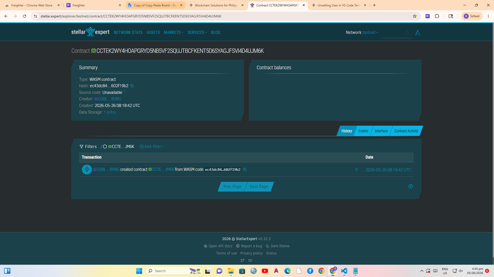

# LupaLink Ledger

An immutable blockchain land title registry paired with atomic urban payment clearing for real-world transaction coordination.

## Problem & Solution
Manual verifications of local land titles create bureaucratic gridlocks that leave buyers vulnerable to forgery and slow down investment lifecycles. LupaLink implements Soroban smart contracts to bind property titles with user decentralized identities, running atomic stablecoin swaps that trade property deeds for digital cash instantly.

## Timeline
- **Milestone 1:** Smart Contract logic validation and unit testing completion.
- **Milestone 2:** Local Node deployment via Testnet RPC channels.
- **Milestone 3:** Full web integration and user dashboard simulation demonstration.

## Stellar Features Used
- Soroban Smart Contracts (`soroban-sdk`)
- Native Asset / Token Interfaces for PHP-pegged value transfers
- Cryptographic Identity Addresses (`Address`)

## Vision and Purpose
To protect generational wealth for rural farmers and municipal buyers, engineering an administration-proof landscape free of falsification records and unnecessary clearing agents.

## Prerequisites
- Rust (v1.75+)
- Target toolchain: `wasm32-unknown-unknown`
- Soroban CLI installed locally

## How to Build
```bash
soroban contract build

Contract ID : CCTEK2WY4HOAPGRYD5NB5VF2SQUJTBCFKENT5D6SYAGJFSVI4D4UJM6K
Link : https://stellar.expert/explorer/testnet/contract/CCTEK2WY4HOAPGRYD5NB5VF2SQUJTBCFKENT5D6SYAGJFSVI4D4UJM6K

